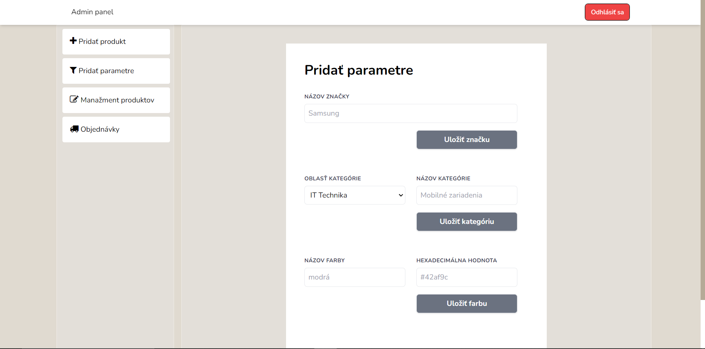

## Web application - online shop

An eshop suitable for any kind of products, built in Laravel.

### Developers

- Ján Ágh
- Irina Makarova
- Márk Bartalos

### Application structure

#### Webshop part

Users can:

- register & log in
- create their own profile
- buy products
- rate products & write reviews
- edit their order inside the shopping cart
- search products by name
- search products by category
- filter products by multiple parameters

#### Administrator part

The admin can:

- log in (with pre-defined credentials)
- create new products (upload images, define configurations)
- edit or delete existing products
- add new parameters (colors, brands, categories)
- browse list of existing orders

### Technologies

- PHP
- Blade
- CSS
- Tailwind CSS
- Bootstrap
- Laravel
- PostgreSQL

### Restore project and install dependencies

```bash
composer install
```

### Run in development mode

```bash
php artisan serve
```

### Design overview - webshop part

#### Main page

The first page that gets displayed to customers. It contains a list of top discounted products, a list of top rated products and the application's sponsors. Also, from here customers can navigate to every other page.


#### Register page

Here, customers can create their own in-application account for storing their address, billing information and shopping cart content.


#### Profile page

The profile page allows registered customers to fill out or update their personal information.


#### Search & filter page

This page gets displayed whenever a customer clicks on a product category on the main page or searches for a product. It offers advanced filtering capabilities together with pagination.


#### Product page

When a customer chooses a particular product, he gets redirected to it's product page. This page contains relevant information about the given products together with every configuration option that is available for the product. Additionally, at the bottom of the page customers can rate the chosen product and write reviews for it.


#### Shopping cart

A customer's shopping cart is made up of 4 pages:

- A cart summary page for reviewing and editing the current contents of the shopping cart
- A details page for choosing the delivery and payment methods
- An address page for filling out billing information (if a customer is logged in and has filled out his profile, his billing information will automatically get inserted here once reaching this shopping cart step)
- A confirmation page for assuring customers that their order was successfully accepted


### Design overview - administrator part

#### Admin login page

This page is accessed from the main page and is used to authenticate the system admins.


#### New product page

From here the admin can create a new product, set a price or discount rate for it, upload images and define any number of configurations. This page is also used for editing existing products.


#### New parameter page

This page allows the admin to create any product parameters, including new brands, new product categories or specific parameters that the customers can use during product filtering.



#### Orders page

Here the admin can review the details of every created order.


Copyright &copy; 2023. All rights reserved.